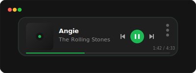
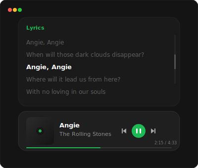

# Spotify Widget

Masaüstünüzde çalan şarkıyı gösteren, Windows ve Spotify ile tam senkronize çalışan, modern ve minimalist bir Electron widget'ı. Herhangi bir Spotify API anahtarı veya kullanıcı girişi gerektirmeden çalışır.

---

## Görsel Önizleme

### 1. Kompakt Mod (Karanlık Tema)



### 2. Genişletilmiş Söz Paneli Modu



---

## Özellikler

* **Buzlu Cam (Glassmorphism) Tasarımı**: Arka plan bulanıklığı ve yarı şeffaflık ile masaüstünüzle bütünleşen arayüz.
* **Dinamik Boyutlandırma ve Ölçekleme**: Arayüzü fare tekerleğiyle veya kenarlarından çekerek %60 ile %150 arasında ölçeklendirebilme.
* **Dinamik Söz (Lyrics) Paneli**: Şarkıyla senkronize kayan sözleri veya düz metin sözlerini görüntüleme paneli.
* **Tam Şeffaflık Modu**: Widget arka planını ve çerçevesini tamamen gizleyerek sadece albüm kapağını, şarkı adını ve kontrolleri masaüstünde yüzer halde bırakma seçeneği.
* **Tema Desteği**: Sistem tercihlerine veya manuel seçime göre anında değişebilen Karanlık ve Aydınlık tema yapıları.
* **Sistem Tepsisi (Tray) Entegrasyonu**: Windows görev çubuğu sağ tık menüsünden ölçek, tema, sözler ve şeffaflık ayarlarını yönetebilme.
* **Medya Denetimleri**: Önceki, Oynat/Durdur ve Sonraki şarkı butonları ile aktif ilerleme takibi ve zaman göstergesi.
* **Sıfır API Entegrasyonu**: Spotify geliştirici hesabı veya kullanıcı girişi gerektirmez. Windows üzerinden çalışan güvenli ve hafif bir arka plan izleyicisi kullanır.

---

## Çalıştırma ve Kurulum

### Gereksinimler

Projenin çalıştırılması için bilgisayarınızda **Node.js** veya **Bun** kurulu olmalıdır.

### Adımlar

1. Proje dizinine gidin:
   ```bash
   cd C:\Users\emir.sari\Desktop\spotify-widget
   ```

2. Bağımlılıkları yükleyin:
   ```bash
   npm install
   ```

3. Uygulamayı geliştirici modunda başlatın:
   ```bash
   npm start
   ```

---

## Taşınabilir (.exe) Dosya Oluşturma

Projeyi tek bir çalıştırılabilir dosya haline getirmek ve kurulum gerektirmeden kullanabilmek için aşağıdaki komutu çalıştırabilirsiniz:

```bash
npm run package
```

Bu işlem tamamlandığında paketlenmiş sürüm şu konumda oluşturulacaktır:
`C:\Users\emir.sari\Desktop\spotify-widget\dist\SpotifyWidget 1.0.0.exe`

---

## Teknik Ayrıntılar

* **Hafif İzleyici Metodu**: Uygulama, arkaplanda `Spotify` işlem başlığını (`MainWindowTitle`) inceleyen ve UTF-8 çıkış üreten hafif bir PowerShell betiği çalıştırır. Bu sayede Spotify API sınırlarına takılmaz ve ağ trafiği harcamaz.
* **ASAR Uyumluluğu**: Paketlenen uygulamada PowerShell betiğinin sanal arşiv dosyaları nedeniyle çökmemesi için betik, uygulamanın çalışması esnasında geçici sistem dizinine (`%TEMP%`) çıkarılarak güvenli bir şekilde tetiklenir.
* **Hafif Bellek Tüketimi**: Arka plan izleyicisi 500ms aralıklarla minimum sistem kaynağı tüketecek şekilde optimize edilmiştir.
